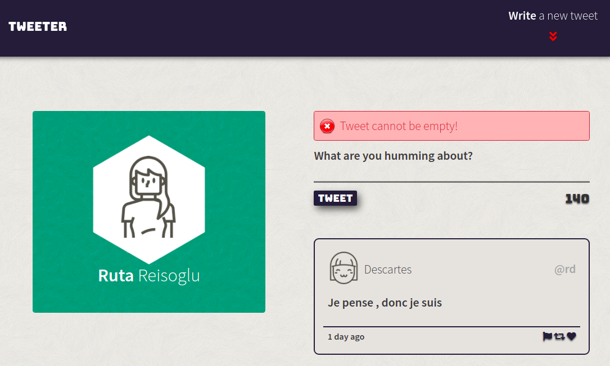
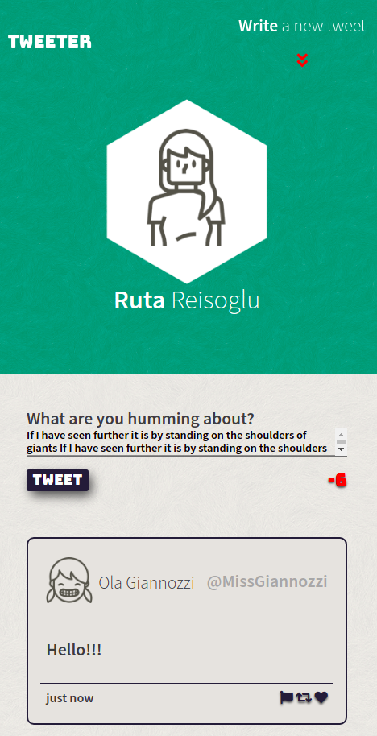
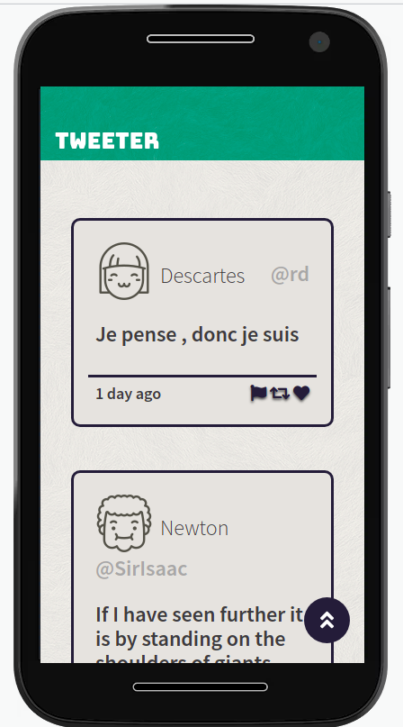

<h1 align="center">
  Tweeter
</h1>
<h3 align="center">A single-page Twitter clone</h3>
<p align="center">
  
  
  
</p>

## Description
This is a simple Twitter clone that was built as a week 4 front-end project for the Lighthouse Labs bootcamp.

## Key Features
* Create tweets
* AJAX GET and POST requests to display and save tweets
* Animated navbar button and 'back to top' button
* Slide in/out tweet composition area
* Error messages on tweet submission
* Updated tweet character count
* Clear focus styles on all interactive elements for web accessibility 
* Mobile responsive

## Project Screenshots
<p align="center">
  
</p>
<p align="center">
  
  
</p>

## Built With
* [JavaScript](https://developer.mozilla.org/en-US/docs/Web/JavaScript) - Programming language
* [JQuery](https://jquery.com/) - JavaScript library

## Dependencies

*  Node 5.10.x or above
*  Express
*  chance
*  body-parser

## Getting Started
Clone the repository:
```
git clone git@github.com:RReiso/tweeter-app.git
cd tweeter-app
```
Install dependencies:
```
npm install
```
Start the server:
```
npm run local
```
You can see the project running at [http://localhost:8080](http://localhost:8080)

## Reflection
This was my first time working with jQuery library, I used it's methods to fetch data from the server, manipulate the DOM, create event listeners and animate HTML elements. Referencing the official jQuery documentation, I learned how to write and utilize the 'animate' method to create custom animations.

